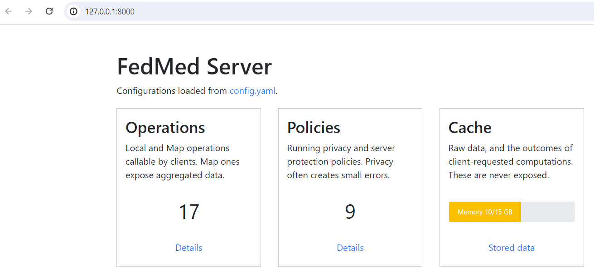
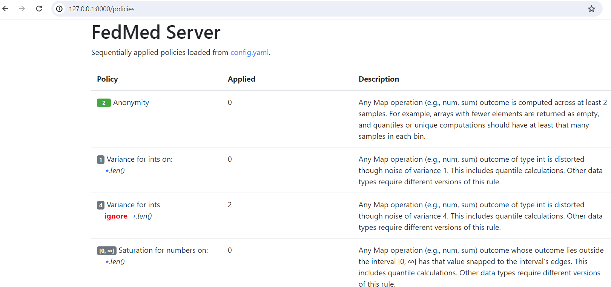

Server setup
============

Data providers can set up servers, each providing a number of
independent data fragments. Clients will then be able to combine
fragments from multiple servers to perform statistical analysis
on them. Server owners have full control of their data and
applied privacy policies; clients can only run operations they
are allowed to.

Configuration
-------------

Data servers host your data for clients to use. Custom operations
that clients can call are specified in the configuration file;
these are either the map part of a map-reduce scheme or internal
server computations that are never exposed internally.
Often, you will have the same configuration for your servers
and the client that uses them. Find a first default configuration
that you can edit
:ref:`here <https://github.com/maniospas/FedMed/blob/main/example/config.yaml>`.
You can replace paths to implementations with your own,
or remove any operations you do not want
to support for privacy reasons. More details on
configuration files can be found :doc:`here <../config/mapreduce>`.

.. warning:: Privacy policies in the configurations
    may make `fedmed.ops.private` operations inexact.

Declare data fragments
----------------------

Creating a server requires the couple lines of code below.
In production, add data directly to instances of the `Server`
class and run the latter. However, in development
you may be interested in running :doc:`simulations <../basics/simulation>`.
Each server contains fragments of one or several datasets.
Load data as pandas dataframes or combinations of lists and dicts.
Then assign them as named fragments by using the server's object
like a dictionary. An example code to do this is shown below;
clients will be able to access this fragment using your server's
IP address and its name.

.. code-block:: python

    import fedmed as fm
    server = fm.Server(config="config.yaml")

    data = [1, 2, 3]  # or dict of lists, pandas dataframe, etc
    server["test array part 1"] = data  # set up the data fragment

Run the server
--------------

You can run a server with a flask-supporting WSGI library,
like waitress. Running it makes its data publicly available
to those having access to its `host:port` IP address.
Client pointing to that address can include the server's
data fragments in their operation.
*FedMed* does not provide any authentication capabilities -
set up a reverse proxy server to restrict who can access
your data with authentication.

.. code-block:: python

    from waitress import serve

    if __name__ == "__main__":
        serve(server.app, host="127.0.0.1", port=8000)

.. tip:: You may use flask to test servers, but for production
    always use an WSGI library or tool.

Information panel
-----------------

Once you start a *FedMed* server you will be able
to access its information panel in its host address. This provides
a summary of :doc:`configuration <../config/aboutconfig>`
and usage patterns. For example, it monitors cashed intermediate
operations, and the frequency of usage of privacy policies.
The information panel looks like this:

As an example, take a look at privacy usage. This contains
detailed explanations and usage counts:

